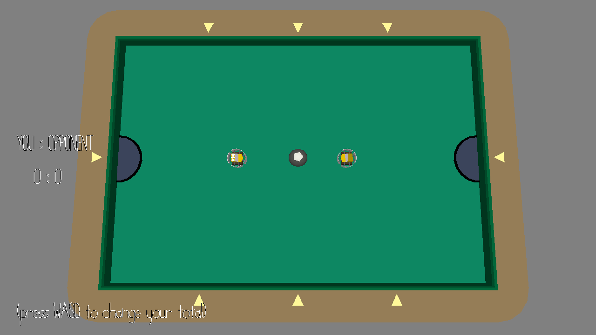

# Random Ball

Author: Fengying Yang & Yunfei Cheng

Design:

- Two players can play the random ball and gain scores by kicking the ball into the goal. The ball will move in any random directions when it gets hit by the player.
- We set the mechanism that
  - One needs to wait for the other's joining to start the game.
  - If anyone quits the game accidently, he can join it again as the same player without restarting the game.
  - If both of the players quit the game, the game will restart.
- We were trying to implement a collision detection mechanism of hitting multiple balls and tracking the positions and collisions of two players and balls but it seemed way more complicated than what we expected.. So finally we took a step back and simplified the game to be two players hitting one random ball. We'd appreciate it if you happens to have or can share any resources about tracking the collisions between a dense group of objects, like billiards.

Networking: 

- We transmit the data by connections as in the course code.
- We have set the data format, which is composed of the size of the data and the data (a formatted string)
- You can find the code in server.cpp and PlayMode.cpp.

Screen Shot:

How To Play:

- The player can gain scores by hitting the ball into the goal with WASD keys.

Sources:

- We made the scene based on pool.blend by Jim McCann

This game was built with [NEST](NEST.md).

